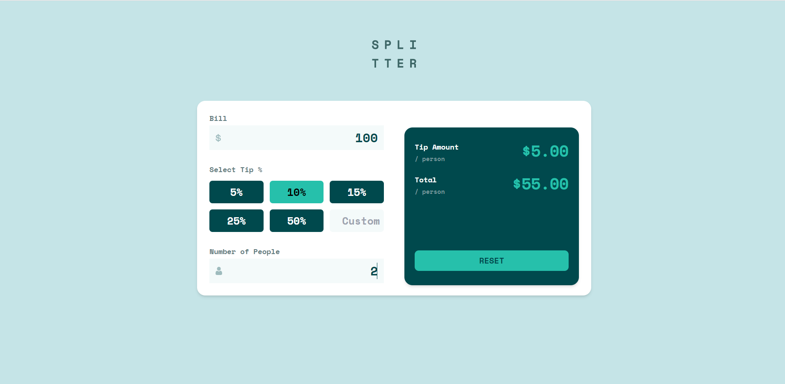

# Splitter

A simple tip calculator app built using React.js and Tailwind css.
This is a solution to the [Tip calculator app challenge on Frontend Mentor](https://www.frontendmentor.io/challenges/tip-calculator-app-ugJNGbJUX).
 
 

### Screenshot

